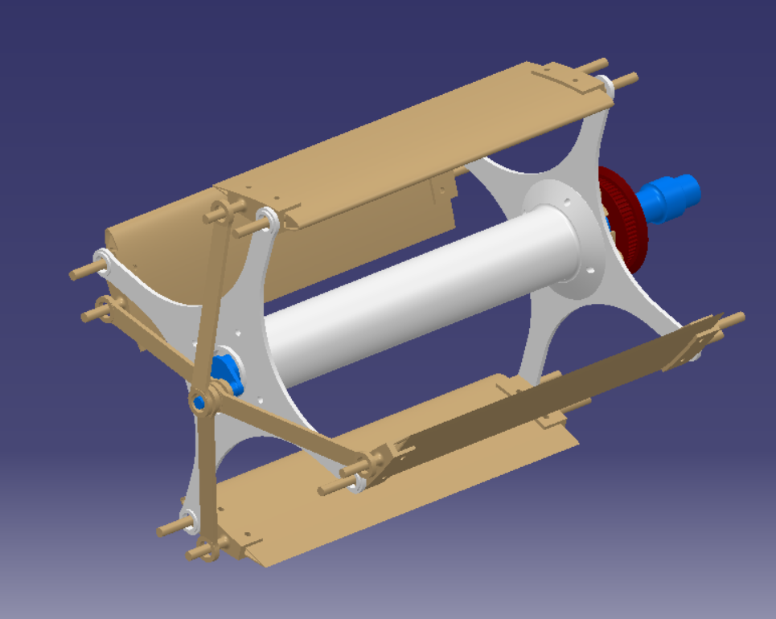
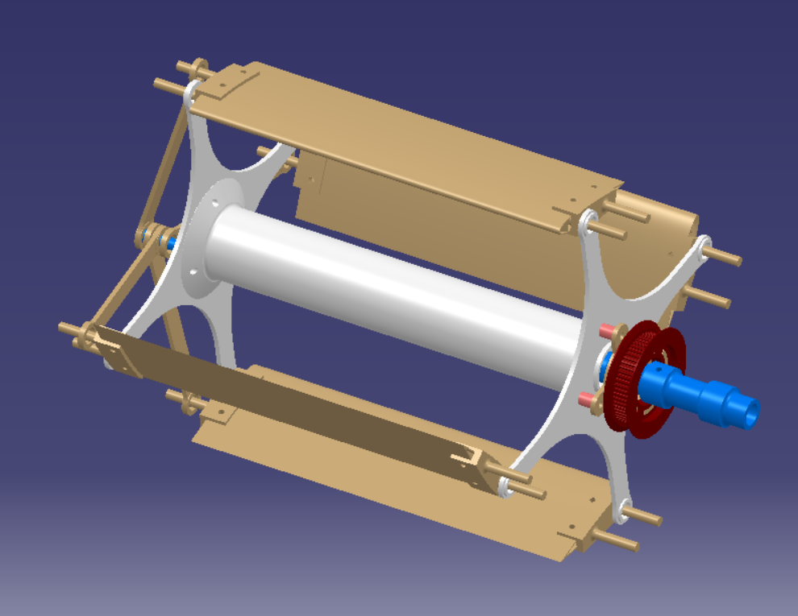
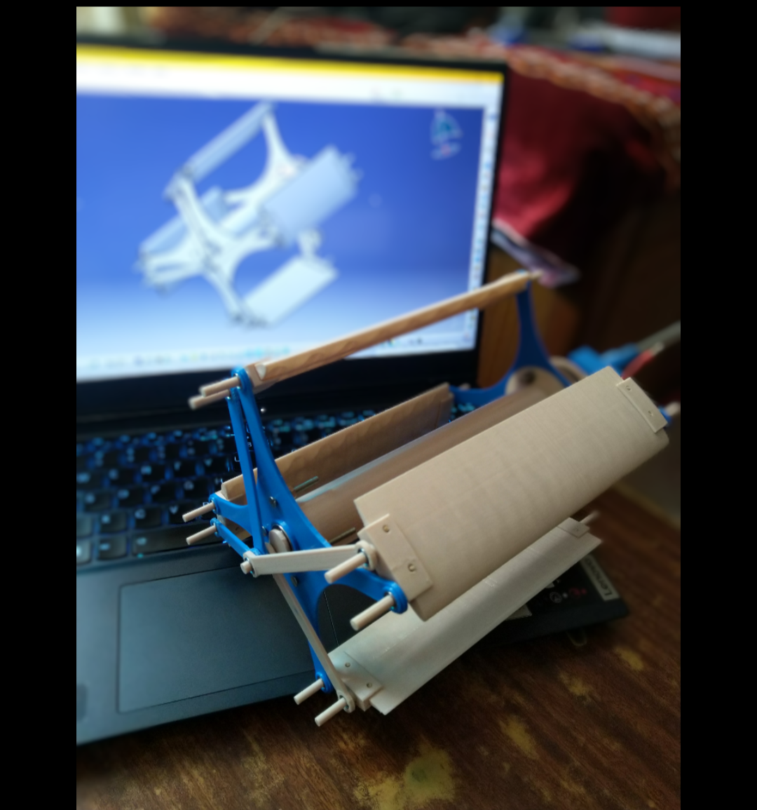

# My Projects Insights

## Experimental Study of Thrust Vectoring in Cyclorotor

#### WHAT is this projcet?
Cyclorotor is a horizontal axis propulsion system which has been brought back to the main stream of research for study of its viability in aviation commuter segement like flying cars. This project aimed to study the thrust vector experimentally to understand the possibiities of better control and maneuverability of the system.

#### HOW was it done?
- Select optimal design parameters from literature review.
- Develope the CAD model and simulate for viability of the mechanisms.
- Design a power transmission system as per the torque requirement a along with bushings and brackets.
- Operate kinematic simulation of the assembled design.
- Design for manufacturing and Manufacture by 3D printing.

#### Accomplishments !!!
- Precise 3D printed parts.
- Perfect fits of the assembly parts.
- Successful custom power transmission system development.
- Successful operation and experimentation.

