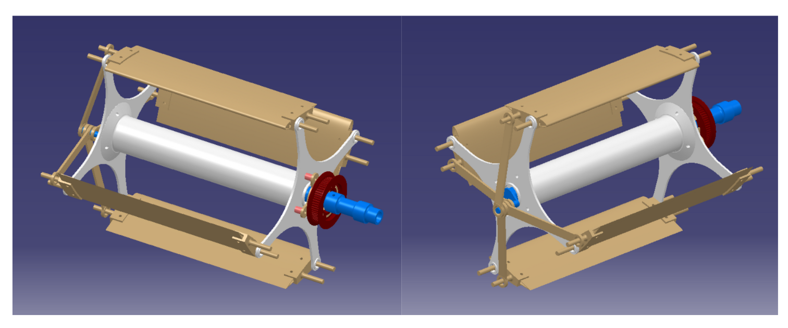
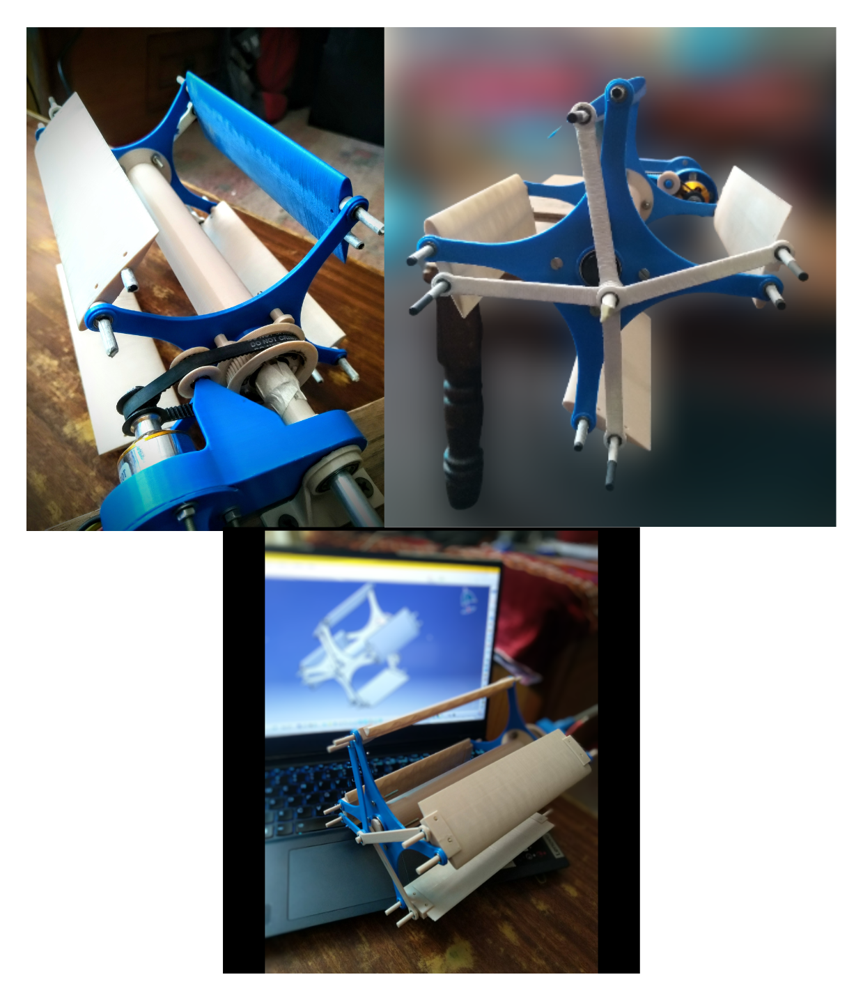
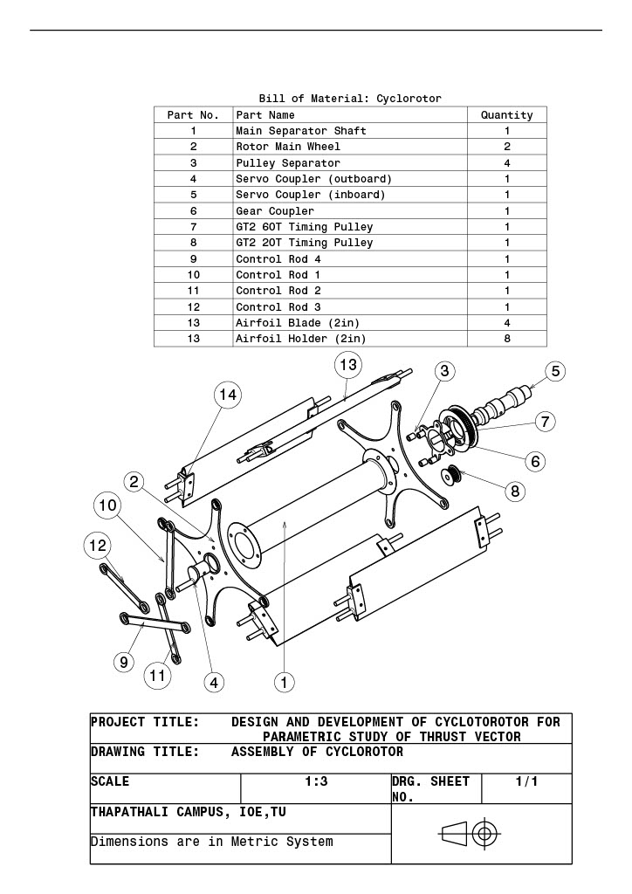
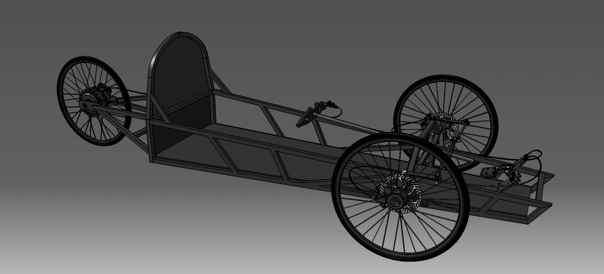
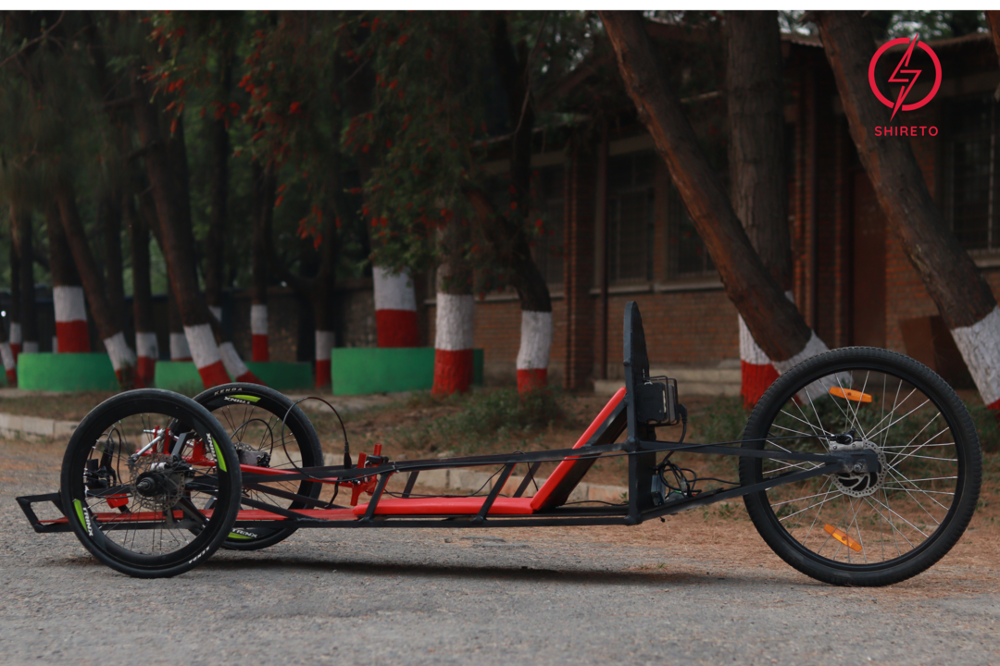
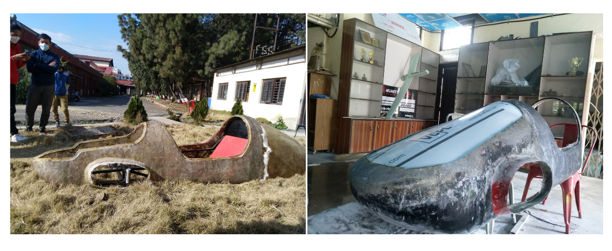
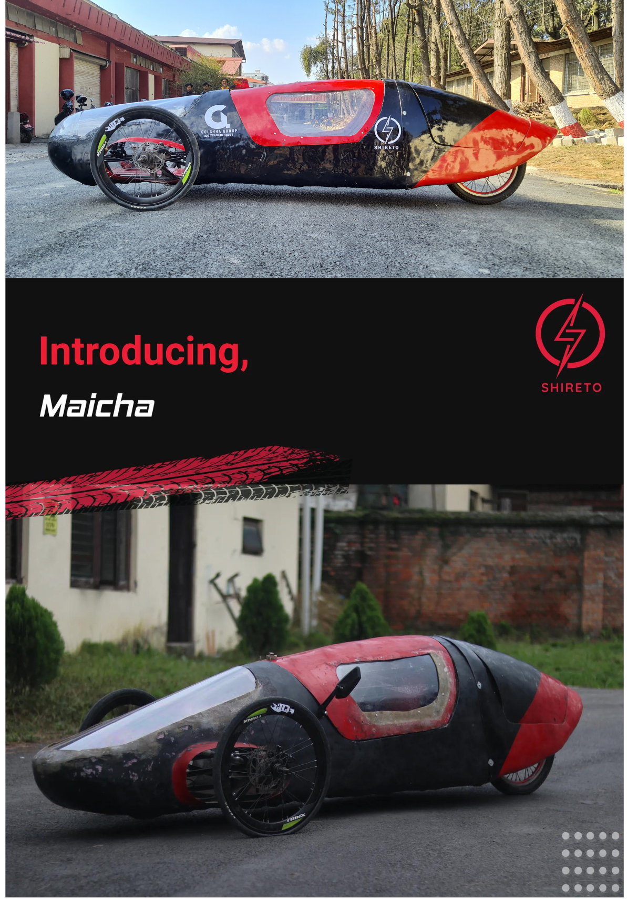
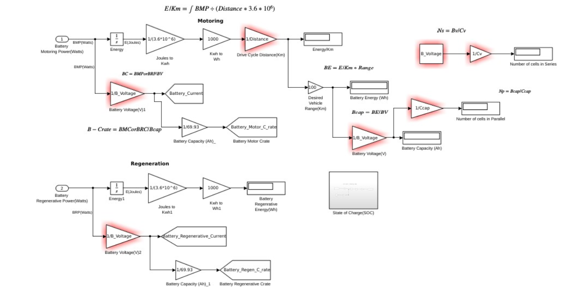
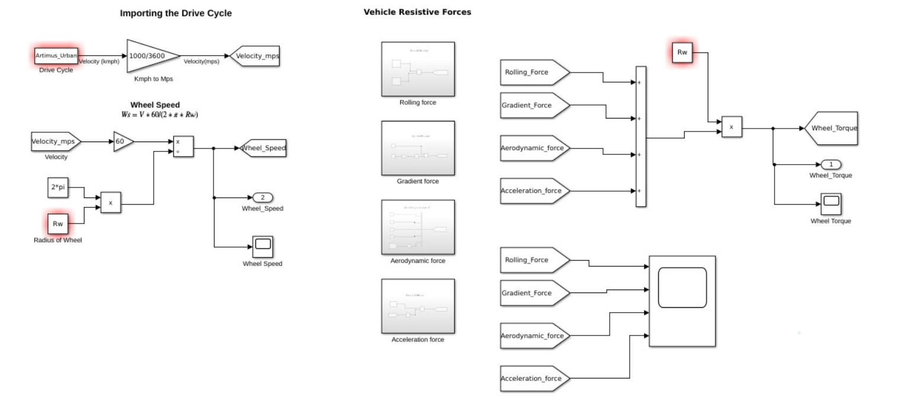
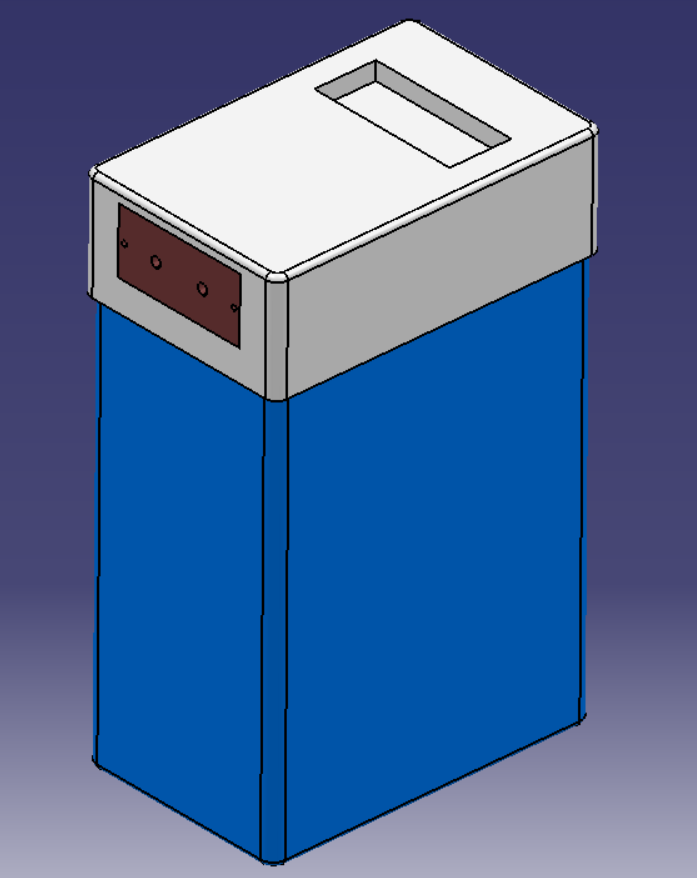

# My Projects Insights

## 1. Experimental Study of Thrust Vectoring in Cyclorotor

#### WHAT is this project?
Cyclorotor is a horizontal axis propulsion system which has been brought back to the main stream of research for study of its viability in aviation commuter segement like flying cars. This project aimed to study the thrust vector experimentally to understand the possibiities of better control and maneuverability of the system. This project was carried out for the partial fulfillment of my bachelor's degree.
#### HOW was it done?
- Select optimal design parameters from literature review.
- Develope the CAD model and simulate for viability of the mechanisms.
- Design a power transmission system as per the torque requirement along with bushings and brackets.
- Operate kinematic simulation of the assembled design.
- Design for manufacturing and Manufacture by 3D printing.

#### Accomplishments
- Precise 3D printed parts.
- Perfect fits of the assembly parts.
- Successful custom power transmission system development.
- Successful operation and experimentation.
- Observation of 360 degree thrust vectoring capability.
- Thrust direction observed to be always opposite to the eccentric point in case of four blades system.

## 2. Shireto

#### WHAT is this project?
Shireto is a dynamic student-led group of motorsport enthusiasts from various disciplines within Thapathali Campus with the aim to enhance the knowledge on vehicle development and participate in racing events and competitions globally. The project started in 2019 with the aim to participate in Shell Eco Marathon in EV category and we successfully manufactured a competitive prototype. Now team Shireto is working on formula type cars to participate in Formula Student events.

The car was designed and developed based on the guidelines of Shell Eco Marathon and was pure electric. The main aim was to acquire as much mileage as possible with few power consumption hence, the structures were designed to the optimal weight to strength ratio with aluminium. Body was manufactured using fiberglass applying the casting method. Powertrain consisted a hub-motor attached wheel and a self developed controller powered by LiFePo battery.

#### HOW is it done?
- CAD modeling and CAE analysis of the structures
- Mannequin analysis for driver comfort
- Chassis fabricaion using MIG welding on aluminium tubes
- Casted fibreglass body panel
- Hub-motor powertrain system

#### Accomplishments
- Guidelines compliant competitive vehicle
- Optimal aerodynamics
- Stern chassis structure
- 70+ Km range with 1KWh of energy

## 3. EV Conversion
#### WHAT is this project?
This project was carried out in collaboration with EVahan (a startup company in Nepal) with my responsibility as General Engineer. It focused on successfully converting an ic engine powered two-wheeler vehicle into pure electric.

#### HOW is it done?
- Motor sizing according to the client's drive cycle using MATLAB/Simulink.
- Motor selection and battery sizing for the desired range.
- Swing-arm modification for the installment of motor.
- Battery casing attachment to the chassis.
- Redesigning the wiring system.

#### Accomplishments
- Completely operational vehicle
- Safe and road compliant
- Full electric with regenerative braking and 3 driving modes

## 4. Battery Casing
#### WHAT is this project?
A fire insulated battery casing was designed and manufactured in collaboration with EVahan (a startup company in Nepal) with my resposibility as General Engineer.

#### HOW is it done?
- Dimensions extraction from the battery cluster, BMS, display console, and power socket
- CAD part and assembly design
- Manufacture using 3D printing technique

#### Accomplishments
- Perfectly fit casing with fire insulation inside
- Proper placement of display and power sockets
- Well developed product
